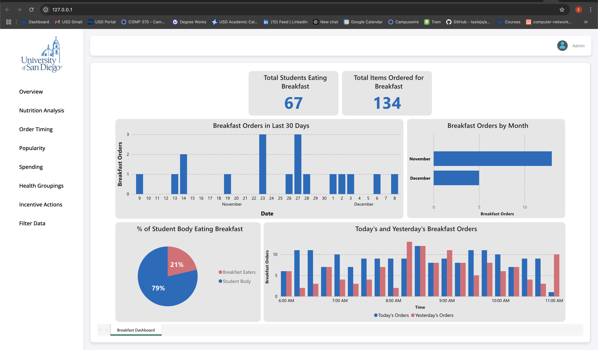

# COMP-49X-24-25-TransactCampus

Dashboard to view campus student dining data and trends.

To run: Run pip install requirements.txt to import necessary modules. Then run Flask application, and sign into PowerBI account when page is open.

Sprint 1: Implements PowerBI dashboard to view data summary for dummy breakfast data. Right now, you must sign into a valid PowerBi account so the report isn't public to everyone, and only viewable by users in the Workspace. In an upcoming sprint we will implement a login screen, so a PowerBI account isn't necessary. 

## Screenshot

## Poster

